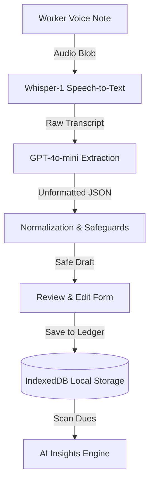

# Shram Ledger

> **A trusted work ledger powered by voice.**

Shram Ledger is an offline-first work record and decision-support tool for daily-wage and informal workers in India. Instead of navigating complex forms, workers simply record a short note in their own words. The app transcribes it, extracts structured fields, and lets the worker review and confirm the entry to save it locally.

Built for **Codex Nightline — OpenAI Build Week Community Hackathon**.

---

## Why Shram Ledger?

Millions of informal workers in India rely on memory, paper notebooks, or scattered voice notes to remember who they worked for, how much they earned, and what payments are still pending. Notebooks get lost. Typing is too slow.

Shram Ledger makes keeping a work record as simple as speaking. Workers record a short voice note, AI prepares a structured draft, and the worker confirms and saves it. 

---

## Product Philosophy

> **AI extracts. The worker confirms.**

Technology should reduce friction — not reduce ownership. We believe AI is a formatting layer, not a decision-maker. Shram Ledger puts the worker, not the AI, in absolute control of their own work history.

---

## Key Features

1. **Voice-to-Record** — Speak naturally for up to 20 seconds. Whisper transcribes and GPT-4o-mini extracts the key facts: employer, hours, paid amount, pending amount, date, and notes.
2. **Human-in-the-Loop Review** — AI outputs are presented as a draft. The worker holds final authority and can edit any field before saving.
3. **Dynamic AI Insights** — Scans the current ledger locally to calculate outstanding balances and suggest action-oriented steps (e.g., *"You have ₹500 in pending payments. Consider following up with Rajesh about the ₹300 pending from 2026-07-18."*).
4. **Resilient Offline Fallback** — Built to survive dead Wi-Fi zones. If the backend API times out or is unreachable, the client dynamically transitions to an offline mode with a structured fallback draft, preventing demo crashes.
5. **One-Click Demo Data** — Easily demonstrate empty states vs. populated ledgers using the "Load Demo Data" button in the empty state screen.
6. **Worker-Owned Privacy** — Persists entirely in the browser's IndexedDB. No accounts, no cloud database, and no server sync.

---

## Design Principles

- 🎙 **Voice-first** — Low barrier of entry for varying literacy levels.
- 👤 **Worker-verified** — Zero automation on the final record.
- 🔒 **Privacy by default** — Local storage only, scoped entirely to the device.
- 📱 **Offline-resilient** — The workflow never stalls when connection drops.
- ⚡ **Zero-setup** — Instant usage without accounts or signups.

---

## AI Architecture



---

## Tech Stack

- **Framework:** Next.js 16 (App Router) + React 19 + TypeScript
- **AI:** OpenAI Whisper-1 (speech-to-text) + GPT-4o-mini (structured JSON extraction)
- **Storage:** IndexedDB via `idb` — client-side persistence
- **Validation:** Zod schemas for both parsing and database writing
- **Deployment:** Vercel-ready

---

## Future Roadmap

- 👥 **Employer verification** — Double-entry logs via local link sharing.
- 🔄 **Optional cloud sync** — User-controlled encrypted backup.
- 🗣 **Multilingual UI** — Audio visual feedback and prompts in regional languages.
- 📊 **Credit ledger** — Exportable history to support micro-credit/loan applications.
- 🔔 **Actionable notifications** — Direct SMS/WhatsApp payment follow-ups.

---

## Run Locally

### Prerequisites

- Node.js 20+
- pnpm (`npm install -g pnpm`) or npm

### 1. Clone and Install

```bash
git clone https://github.com/sanjay-sanju-03/Codex-Nightline.git
cd Codex-Nightline/voice-work-history
pnpm install
```

### 2. Set Up Environment Variables

```bash
cp .env.example .env.local
```

Open `.env.local` and add your OpenAI API key:

```env
OPENAI_API_KEY=sk-proj-...
```

> **No API key?** Leave `OPENAI_API_KEY` blank. The app will automatically run in local fallback mode — the full record → review → save workflow will still function.

### 3. Start the Dev Server

```bash
pnpm dev
```

Open [http://localhost:3000](http://localhost:3000).

---

## Environment Variables

| Variable | Required | Default | Description |
|---|---|---|---|
| `OPENAI_API_KEY` | No | — | Enables live Whisper + GPT extraction. Leave empty for local fallback. |
| `OPENAI_TRANSCRIPTION_MODEL` | No | `whisper-1` | Override the transcription model |
| `OPENAI_EXTRACTION_MODEL` | No | `gpt-4o-mini` | Override the extraction model |

---

## Deploy to Vercel

1. Import this repository in [Vercel](https://vercel.com).
2. Set the **Root Directory** to `voice-work-history`.
3. Add `OPENAI_API_KEY` under **Settings → Environment Variables**.
4. Deploy.

---

## Project Structure

```
src/
├── app/
│   ├── api/parse/route.ts   ← Whisper + GPT extraction (server only)
│   ├── page.tsx             ← Full client UI, state, and offline hooks
│   ├── layout.tsx
│   └── globals.css
├── components/
│   └── voice-recorder.tsx   ← MediaRecorder lifecycle
├── services/
│   └── normalization.ts     ← Date and number cleanups + safeguards
├── schemas/
│   └── work-log.ts          ← draftSchema + extractionSchema
├── lib/
│   └── work-log-db.ts       ← IndexedDB wrapper: get / put / delete
└── types/
    └── work-log.ts          ← WorkLogDraft, WorkLog, ParseResponse
```

Full documentation is available in the [`docs/`](./docs/00-README.md) folder.

---

## Demo Script (90 seconds)

See [`docs/06-Demo.md`](./docs/06-Demo.md) for the setup checklist, step-by-step narration, and Q&A prep.

---

## License

This project is licensed under the [MIT License](LICENSE) - see the LICENSE file for details.
